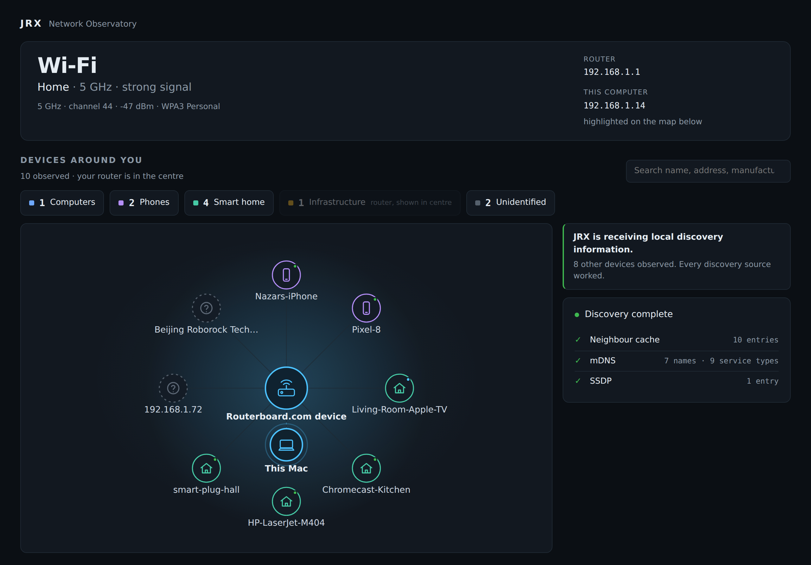

# JRX Network Observatory

[](https://github.com/NaZaR228wate/JRX-Network-Observatory/actions/workflows/ci.yml)

**The network map that tells you what it knows — and what it doesn't.**

JRX is a local-first desktop app that makes your own network legible. It shows
what you are connected to, who else is on the network, what your own computer is
doing on it, and — the part almost nothing else does honestly — exactly where
its knowledge ends. JRX would rather say *"unidentified"* than guess, and it is
built so that guessing is hard to do by accident.

It runs entirely on your machine. No account, no cloud, no packet capture, no
administrator access. macOS today; the design keeps the door open for Windows
and a mobile companion later.

> Status: macOS, in active development. Everything described below runs; claims
> here are held to the same evidence standard as the code (see
> [Honesty & testing](#honesty--testing)).

---

## A look

Shown on JRX's built-in **demo network** — deterministic fixture data, not a real network.




---

## Why it exists

Most network tools do one of two things: they drown you in packets, or they make
confident claims they cannot back up — labelling a device an "iPhone" from a MAC
prefix, or turning an IP address into "websites you visited." Both are a kind of
dishonesty.

JRX takes the opposite stance. Every screen separates **what was observed** from
**what was inferred**, cites the evidence behind each conclusion, and states
plainly what it cannot see. That restraint is the product.

---

## What it shows you

- **Network identity** — your connection (Wi-Fi, Ethernet, a phone hotspot, or
  an honest "unknown"), the network, the router, your address. A VPN is shown as
  a *tunnel over* your physical connection, never as a replacement for it.
- **Visibility** — a panel that explains, for every capability, whether JRX can
  **observe** it here, could with a **permission**, **cannot** on this platform,
  or **refuses** it by design. The differentiator ships before the pretty map.
- **Devices** — passive discovery from the OS's own neighbour cache, mDNS, and
  SSDP, with an offline IEEE vendor database. No subnet sweeping.
- **Device intelligence** — evidence-based classification that stays
  *Unidentified* when the evidence is thin. A randomised MAC is reported as a
  device protecting itself, not guessed at.
- **Topology** — a calm, hierarchical map: the router at the centre, this
  computer highlighted, everything else grouped by kind, bounded so a network of
  150 devices renders as a handful of nodes rather than a wall of dots.
- **Activity** — this computer's live network use, without admin rights: current
  throughput, which programs are talking and how much, their connections, and
  the *network owner* of a remote address when a published allocation says so —
  never dressed up as a website.
- **Recognition** — JRX remembers, locally, the networks and devices it has seen,
  so it can tell you *"you have been on this network before"* and *"N devices you
  have not seen here before."* It stores one-way fingerprints only — never a
  name, address, or MAC — and a single button erases everything it has learned.

---

## What it refuses to do

These are commitments, enforced by tests and by what is absent from the
dependency graph — not settings you can toggle:

- **No packet payloads, no message or credential capture.** There is no capture
  library in the build.
- **No TLS interception.** Ever.
- **No browsing history, no DNS-query logging.** JRX reads which resolvers you
  are configured to use; it never records what you looked up.
- **No IP-to-website mapping.** A network owner (say, "Cloudflare") means the
  address belongs to that network's published range — *not* that you visited
  their site. Reverse DNS resolved nothing for 12 of 12 live endpoints when
  measured, and would not be proof even when it does.
- **No other device's traffic.** On a switched, encrypted network an ordinary
  machine cannot see it, and JRX will not pretend otherwise.
- **No root or administrator access. No cloud. No account. No telemetry.**

---

## How it works

A small Rust workspace with a strict dependency direction — `app → collector →
core` — chosen so that most of the logic is pure, testable, and reusable:

| Crate | Role |
|---|---|
| **`core`** | Pure domain logic: identity, classification, evidence, topology, the capability model, activity accounting, and network/device recognition. No OS, no network, no UI — every rule is unit-testable offline, and this is the exact layer a future mobile client reuses. |
| **`collector`** | The only OS-facing code: interfaces, routes, Wi-Fi, ARP/mDNS/SSDP discovery, the offline OUI database, the activity provider, and the local SQLite recognition store. |
| **`app`** | A [Tauri](https://tauri.app) v2 host and a React/TypeScript UI. The renderer is treated as untrusted: authoritative state lives in Rust, and the UI receives typed snapshots — it cannot widen what JRX collects. |

Two deliberate choices worth calling out:

- **`nettop` is a tool, not an API.** Per-process bandwidth on macOS is available
  unprivileged through Apple's shipped `/usr/bin/nettop`. JRX runs that binary
  and parses it behind a provider boundary — it never links the private
  `NetworkStatistics` framework. If the output format ever changes, activity
  degrades gracefully instead of lying.
- **The vendor database is bundled.** MAC addresses are never sent to an online
  lookup — doing so would disclose your device inventory to a third party.

Architecture and the reasoning behind each decision live in
[`ARCHITECTURE.md`](ARCHITECTURE.md) and [`TECH_DECISIONS.md`](TECH_DECISIONS.md)
(21 ADRs and counting).

---

## Honesty & testing

The project holds its own claims to the standard it holds its UI to. Findings
are labelled **physically validated**, **fixture validated**, or **unverified** —
and the distinction is never blurred. A milestone is not "done" because a browser
preview looked right; it is done when the real bundled app has been exercised
end-to-end.

- **~390 automated tests** across the workspace (`core` 194, `collector` 134,
  `app` privacy invariants 8, frontend 54).
- **Mutation-tested honesty rules.** The tests that protect the product's
  integrity — "an address never becomes a hostname", "a byte count is measured,
  never modelled", "a randomised MAC is never a *new device*" — are checked by
  deliberately breaking the code and confirming they fail — see
  [`metrics/mutation.md`](metrics/mutation.md) for a run and its honest
  accounting of what survived and why. A green test that cannot fail is treated
  as worse than no test.
- **Compile-time guardrails.** Development fixtures cannot be compiled into a
  release build; the privacy invariants are asserted in CI, not just intended.

---

## Running it

Requires the Rust toolchain and Node. JRX must be built and run through the
**Tauri CLI**, never a bare `cargo` binary (a plain `cargo run` bakes in a dev
server URL and renders a blank window — see `TECH_DECISIONS.md`).

```sh
cd app
npm install
npm run dev:app      # development, with hot reload
npm run build:app    # a standalone .app bundle
```

**Development scenarios** — deterministic networks (home, university, hotspot,
VPN, isolated, permission-limited, a 500-device stress network) that run through
the *real* classification and view-model logic, so what you validate is the real
pipeline:

```sh
cd app && JRX_FIXTURE=home_wifi npm run demo
```

Fixtures are development-only and fail to compile in a release build.

---

## Status & roadmap

**Working today (macOS):** network identity, the visibility panel, passive
discovery, evidence-based device intelligence, discovery-quality states, the
hierarchical topology, this-Mac live activity, and local recognition of networks
and devices — all validated on real hardware.

**Deliberately not built yet:** Windows (the platform boundary is kept clean for
it), and a mobile companion — which will use an *honest capability model*, since
a phone cannot sniff arbitrary LAN traffic and JRX will not imply it can.

**Never, at any version:** packet capture, payload inspection, DNS-query logging,
browsing history, credential access, silent background monitoring, or cloud
upload of device inventories. These are absent by construction, not disabled by a
flag.

---

*JRX is valuable because it is honest. That is the one feature it will not trade
away for a prettier screen.*
